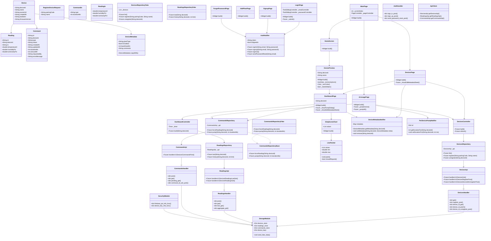

```mermaid
classDiagram
    direction TB

    class Device {
        +String deviceId
        +String name
        +String ownerUid
        +String createdAt
        +String lastSeen
        +String firmwareVersion
    }

    class Reading {
        +String id
        +String deviceId
        +String ts
        +double temperatureC
        +double humidityPct
        +double luminosityPct
    }

    class Command {
        +String id
        +String deviceId
        +String type
        +String status
        +String createdAt
        +String updatedAt
        +int durationMs
        +int amountMl
        +String requestedBy
        +String errorMessage
    }

    class DeviceMetadata {
        +String plantType
        +bool isOutdoor
        +int baseDoseMs
        +String comments
        +DeviceMetadata copyWith()
    }

    class RegisterDeviceRequest {
        +String pairingCode
        +String name
    }

    class CommandIn {
        +String type
        +int durationMs
    }

    class ReadingIn {
        +double temperatureC
        +double humidityPct
        +double luminosityPct
    }

    class DevicesRepository {
        -DevicesApi _api
        +Future list()
        +Future register(String pairingCode, String name)
        +Future unregister(String deviceId)
    }

    class DevicesRepositoryFake {
        -List _devices
        +Future list()
        +Future register(String pairingCode, String name)
        +Future unregister(String deviceId)
    }

    class ReadingsRepository {
        -ReadingsApi _api
        +Future last(String deviceId)
        +Future history(String deviceId, int limit)
    }

    class ReadingsRepositoryFake {
        +Future last(String deviceId)
        +Future history(String deviceId, int limit)
    }

    class CommandsRepositoryBase {
        +Future forceReading(String deviceId)*
        +Future pump(String deviceId, int durationMs)*
    }

    class CommandsRepository {
        -CommandsApi _api
        +Future forceReading(String deviceId)
        +Future pump(String deviceId, int durationMs)
    }

    class CommandsRepositoryFake {
        +Future forceReading(String deviceId)
        +Future pump(String deviceId, int durationMs)
    }

    class DevicesController {
        +Future build()
        +Future refresh()
    }

    class DashboardController {
        -Timer _timer
        +Future build(String deviceId)
    }

    class DeviceMetadataNotifier {
        -Map metadata
        +DeviceMetadata getMetadata(String deviceId)
        +void setMetadata(String deviceId, DeviceMetadata meta)
        +void remove(String deviceId)
    }

    class PerDevicePumpNotifier {
        -Ref ref
        +int getDurationFor(String deviceId)
        +void setDurationFor(String deviceId, int ms)
    }

    class AuthNotifier {
        +String token
        +bool isSignedIn
        +Future signIn(String email, String password)
        +Future signUp(String email, String password)
        +Future signOut()
        +Future sendPasswordReset(String email)
    }

    class MainPage {
        -int _currentIndex
        -PageController _pageController
        +Widget build()
    }

    class HomeScreen {
        +Widget build()
    }

    class DevicesPage {
        +Widget build()
        -Future _showEditMetadataSheet()
    }

    class AddPlantPage {
        +Widget build()
    }

    class DashboardPage {
        +String deviceId
        +Widget build()
        -Future _showPumpDialog()
        -Future _showEditMetadataSheet()
    }

    class ArrosagePage {
        +Widget build()
        -Future _pumpDevice()
        -Future _pumpAll()
    }

    class DevicePreview {
        +String deviceId
        +String name
        +Widget build()
        -IconData _luminosityIcon()
        -Color _lumColor()
        -bool _needsWater()
    }

    class LoginPage {
        -TextEditingController _emailController
        -TextEditingController _passwordController
        +Widget build()
        -Future _submit()
    }

    class SignupPage {
        +Widget build()
    }

    class ForgotPasswordPage {
        +Widget build()
    }

    class SimpleLineChart {
        +List values
        +Widget build()
    }

    class LinePainter {
        +List values
        +double min
        +double max
        +void paint()
        +bool shouldRepaint()
    }

    class DevicesHandler {
        +dict get()
        +dict register_post()
        +dict device_id_get()
        +dict device_id_patch()
        +dict device_id_unregister_post()
    }

    class ReadingsHandler {
        +dict post()
        +dict get()
        +dict last_get()
        +dict aggregate_get()
    }

    class CommandsHandler {
        +dict post()
        +dict get()
        +dict pending_get()
        +dict command_id_ack_post()
    }

    class AuthHandler {
        +dict sign_in_post()
        +dict sign_up_post()
        +dict send_password_reset_post()
    }

    class SecurityModule {
        +dict firebase_jwt_info_func()
        +dict device_key_info_func()
    }

    class StorageModule {
        +Dict devices_store
        +Dict readings_store
        +Dict commands_store
        +Dict device_keys
        +void seed_fake_data()
    }

    class ApiClient {
        +DevicesApi getDevicesApi()
        +ReadingsApi getReadingsApi()
        +CommandsApi getCommandsApi()
    }

    class DevicesApi {
        +Future handlersV1DevicesGet()
        +Future handlersV1DevicesRegisterPost()
        +Future handlersV1DevicesDeviceIdUnregisterPost()
    }

    class ReadingsApi {
        +Future handlersV1DevicesReadingsLastGet()
        +Future handlersV1DevicesReadingsGet()
    }

    class CommandsApi {
        +Future handlersV1DevicesCommandsPost()
    }

    CommandsRepository ..|> CommandsRepositoryBase
    CommandsRepositoryFake ..|> CommandsRepositoryBase

    DevicesRepository --> DevicesApi
    ReadingsRepository --> ReadingsApi
    CommandsRepository --> CommandsApi

    DevicesController --> DevicesRepository
    DashboardController --> ReadingsRepository
    DashboardPage --> CommandsRepository

    DevicesPage --> DevicesController
    DevicesPage --> DeviceMetadataNotifier
    DashboardPage --> DashboardController
    DashboardPage --> DeviceMetadataNotifier
    ArrosagePage --> DevicesController
    ArrosagePage --> PerDevicePumpNotifier
    ArrosagePage --> CommandsRepository

    MainPage --> HomeScreen
    MainPage --> DevicesPage
    MainPage --> ArrosagePage
    HomeScreen --> DevicePreview
    DevicesPage --> DashboardPage
    DashboardPage --> SimpleLineChart
    SimpleLineChart --> LinePainter
    DevicePreview --> DashboardPage

    LoginPage --> AuthNotifier
    SignupPage --> AuthNotifier
    ForgotPasswordPage --> AuthNotifier

    DevicesHandler --> StorageModule
    ReadingsHandler --> StorageModule
    CommandsHandler --> StorageModule
    SecurityModule --> StorageModule

    DevicesApi --|> DevicesHandler
    ReadingsApi --|> ReadingsHandler
    CommandsApi --|> CommandsHandler

    Device --> Reading
    Device --> Command
    Device --> DeviceMetadata
```

